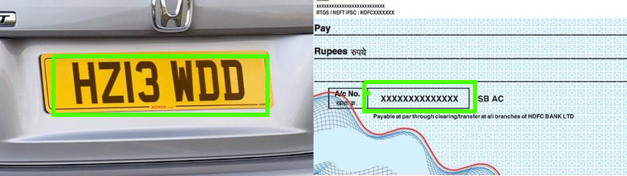
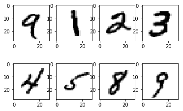

# RealTime DigitRecognizer
RealTime digit-recognizer using Tensorflow/Keras and pygame library. One of part this project is a tutorial in an IPython Notebook created for the Kaggle competition, Digit Recognizer. The second part of this project is deploying a solution into the app which predicts output corresponding to handwritten images.
# Demo
  

# Overview
Recently Deep Convolutional Neural Networks (CNNs) becomes one of the most appealing approaches and has been a crucial factor in the variety of recent success and challenging machine learning applications such as object detection, and face recognition. Therefore, CNNs is considered our main model for our challenging tasks of image classification. Specifically, it is used for is one of high research and business transactions. Handwriting digit recognition application is used in different tasks of our real-life time purposes. Precisely, it is used in vehicle number plate detection, banks for reading checks, post offices for sorting letter, and many other related tasks.  
	
# Installation
To run this notebook interactively:

1. Download this repository in a zip file by clicking on this [link](https://github.com/Mieczmik/digit-recognizer/archive/master.zip) or execute this from the terminal:
`git clone https://github.com/Mieczmik/digit-recognizer.git`
2. Install [virtualenv](http://virtualenv.readthedocs.org/en/latest/installation.html).
3. Navigate to the directory where you unzipped or cloned the repo and create a virtual environment with `virtualenv env`.
4. Activate the environment with `source env/bin/activate`.
5. Install the required dependencies with `pip install -r requirements.txt`.
  6. Execute `ipython notebook` from the command line or terminal and  click on `deeplearning/MNIST.ipynb` in the IPython Notebook dashboard and enjoy!
  6. Or run app.py from main folder and draw the digits on left side of the window and output will appear on right side of the window. Have fun!
  Mouse/keyboard handling: 
  &nbsp;* The left button is for drawing. 
  &nbsp;* Refresh screen: press the R button or the right button on the mouse. 
  &nbsp;* Quit application: press the Q button. 
7. When you're done deactivate the virtual environment with `deactivate`.

# CNN
This is a 5 layers Sequential Convolutional Neural Network for digits recognition trained on MNIST dataset. I choosed to build it with keras API (Tensorflow backend) which is very intuitive. Firstly, I will prepare the data (handwritten digits images) then I will focus on the CNN modeling and evaluation.

I achieved 99.553% of accuracy with this CNN trained in only 30 min on a single CPU (Apple M1).

## Dataset
MNIST ("Modified National Institute of Standards and Technology") is the de facto “hello world” dataset of computer vision. Since its release in 1999, this classic dataset of handwritten images has served as the basis for benchmarking classification algorithms. As new machine learning techniques emerge, MNIST remains a reliable resource for researchers and learners alike. More details about the dataset, including algorithms that have been tried on it and their levels of success, can be found at [link](http://yann.lecun.com/exdb/mnist/index.html).

Each of the 70 000 images is 28 pixels in height and 28 pixels in width, for a total of 784 pixels in total. Each pixel has a single pixel-value associated with it, indicating the lightness or darkness of that pixel, with higher numbers meaning darker. This pixel-value is an integer between 0 and 255, inclusive.

### Sample Images:
These are some sample images of the handwritten character from mnist dataset.   
	  

## Architecture of CNN
In the project the Keras Sequential API was used in the following order:  
(Conv2D &rarr; Conv2D &rarr; MaxPool2D &rarr; Dropout) $\times$ 2 &rarr; Flatten &rarr; Dense &rarr; Dropout &rarr; Out

### Optimizer
Once our layers are added to the model, we need to set up a score function, a loss function and an optimisation algorithm:
* loss function - this function defines how the network performance is measured during the processing of the training dataset, thus allowing the network parameters to be fine-tuned in the right direction,
* optimizer - network tuning mechanism based on the data returned by the loss function,
* metrics - metrics monitored during training and testing.

We define the loss function to measure how poorly our model performs on images with known labels. It is the error rate between the oberved labels and the predicted ones. We use a specific form for categorical classifications (>2 classes) called the "categorical_crossentropy".

The most important function is the optimizer. This function will iteratively improve parameters (filters kernel values, weights and bias of neurons) in order to minimise the loss.

I choosed adam (with default values), it is a very effective optimizer. I recommend comparing theoretical basis of the basic optimizers from:

* [Gradient Descent](https://machinelearningmastery.com/gradient-descent-optimization-from-scratch/)
* [ADAGrad](https://machinelearningmastery.com/gradient-descent-with-adagrad-from-scratch/)
* [RMSProp](https://machinelearningmastery.com/gradient-descent-with-rmsprop-from-scratch/)
* [ADAM](https://machinelearningmastery.com/adam-optimization-from-scratch/)

The metric function "accuracy" is used is to evaluate the performance our model. This metric function is similar to the loss function, except that the results from the metric evaluation are not used when training the model (only for evaluation).
### Data augmentation
In order to avoid overfitting problem expand artificially dataset could be helpful. In this case the idea is to alter the training data with small transformations to reproduce the variations occurring when someone is writing a digit.

For the data augmentation was chosen:
* randomly rotate some training images by 10 degrees
* randomly zoom by 10% some training images
* randomly shift images horizontally by 10% of the width
* randomly shift images vertically by 10% of the height
# RealTime Application
This is a RealTime-DigitRecognition application which can predict output corresponding to handwritten images. I used sequential model of Tensorflow/Keras described above for creating this predictive application.  

The interface is created by using **Pygame**. The image preprocessing is the most important in this project which I have done by using **Scipy** and **OpenCV**.

## Dependencies
This is the list of dependencies for running this application.
 * **Skleran**
 * **Tensorflow**
 * **Opencv**
 * **Pygame**
 * **Pandas**
 * **Numpy**
 * **Scipy**
 * **Matplotlib**
